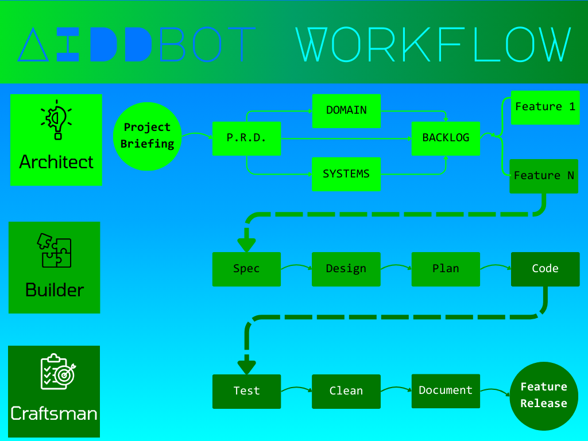

La **generación de software profesional** usando agentes de codificación inteligentes es una realidad. Pero, ¿cómo se integra en tu flujo de trabajo?

Es fácil preparar un **prompt** o un conjunto básico de reglas y ponerse a generar un pequeño proyecto o una solución archiconocida.

Pero, ¿qué pasa cuando quieres generar un **software empresarial**? ¿Qué pasa cuando quieres generar un software que sea mantenible, escalable y que se pueda integrar en un sistema existente?

Necesitas una **metodología de trabajo**. Y un poco de ayuda.

**AIDDbot** es una herramienta que te ayuda a generar software profesional usando agentes de codificación inteligentes.

### La situación actual

Los **modelos de lenguaje** han evolucionado una barbaridad. No importa cuando leas esto. Pero, al mismo tiempo, las expectativas de los programadores y los uso que les damos también ha crecido.

En **proyectos grandes**, la programación por vibraciones (o vibe_coding) no es suficiente. Ni siquiera con un conjunto de reglas o instrucciones que la guíen.

Conforme crece el proyecto, los **agentes** se acaban encontrando con retos que les cueste resolver.

### Los retos

#### Ámbito: 

Conocer la especificación de un **Tic-Tac-Toe** hecho en un framework mainstream para usar como demo es una cosa. Pero desarrollar una sistema de reservas de hoteles con sus pasarelas de pagos, notificaciones y sistema de informes en **Angular**, integrando un servicio legacy en Java, un par de bases de datos y una cache en Node.js es otra. 

No es fácil que todo eso le quepa en la cabeza a ningún **modelo de lenguaje**.

#### Alucinación
Los modelos de lenguaje se basan en **buscar (inferir)** la respuesta más probable en un contexto en base a un conocimiento previo (entrenamiento). Esto plantea dos problemas: la validez y vigencia del entrenamiento, y la dosis de aleatoriedad de la respuesta. 

El resultado puede ser una respuesta que suena razonable pero no es la correcta. Una **alucinación**.

#### Degradación
Al igual que los humanos, los agentes comienzan sus tareas con **entusiasmo y energía**. Pero, conforme avanza el tiempo, la concentración y la motivación (la disponibilidad de la energía) disminuyen. Esto hace que un chat con un agente de IA se vuelva cada vez más incoherente y aleatorio. 

Necesita **empezar de nuevo**.

### Solución

La solución a todos estos problemas es una **metodología de trabajo** que incluya, al menos, los siguientes pasos:

#### Divide y vencerás

Divide las **tareas complejas** en sub-tareas manejables que se pueden abordar individualmente. Esto permite ajustar el contexto y reducir la fatiga de los agentes. Menos alucinaciones y mayor calidad sostenible.

#### File System Memory

Empezar de nuevo cada vez es una solución nada **sostenible**. Para mitigar este problema, se puede usar el **sistema de archivos** como memoria para el contexto y la información de largo plazo. Un conjunto de ficheros con una estructura y un formato que permita a los agentes acceder a la información de forma sencilla y eficiente.

#### Context Engineering

Porque esta es la **nueva clave**, aportar el contexto suficiente sin sobrecargar al agente en cada momento.

Y aquí es donde entra **AIDDbot**. Te proporciona un flujo de trabajo que te ayuda a generar software profesional usando agentes de codificación inteligentes optimizando el contexto para que trabajen de la manera más fiable posible.

Para ello, se establecen una serie de **pasos** con un ámbito y momento de aplicación determinados. Y mediante un sistema de peticiones predefinidas se orquesta un flujo de trabajo que incluye los siguientes elementos:

## Definición del proyecto

Afecta a **todo el proyecto** y tiene lugar al inicio del mismo. Esta abierto a modificaciones y revisiones, pero debe sentar una base inicial sólida sobre la que se pueda trabajar.

### PRD (Product Requirements Document)

Describe los **requisitos del producto**. Tiene que ser corto y entendible por humanos no técnicos. Pero especificar al menos el alcance del problema y la solución esperada.

### Modelo de dominio

Define el **modelo de dominio** del proyecto. Es decir, las entidades y relaciones que lo componen. Sirve para mantener un lenguaje común y un conjunto mínimo de reglas de negocio que deban cumplir los datos.

### Arquitectura del sistema

Detalla los **componentes desplegables** de la solución. Incluye el stack tecnológico y la arquitectura de la solución.

### Backlog

Es la **lista de funcionalidades** que se deben implementar para completar el proyecto. Pueden agruparse en épicas o conjuntos de historias de usuario. Lo más importante es que deben ser ordenadas por prioridad y diponer de algún control de estado para ver su evolución.

## Implementación de características

Afecta a cada una de las **funcionalidades del backlog** y se hará tras la definición del proyecto. Este proceso se divide a su vez en etapas que van refinando la funcionalidad hasta su implementación en código fuente.

### Especificación

Especifica la funcionalidad como **historias de usuario** desde el punto de vista de los stakeholders. Incluye el comportamiento esperado en formato EARS (Easy Approach to Requirements Syntax) para su posterior verificación.

### Diseño técnico

Define la **arquitectura técnica** de la funcionalidad. Incluye el diseño de la base de datos, la interfaz de usuario, la integración con otros sistemas, y reutilización de componentes.

### Planificación

Este es un paso **opcional** para funcionalidades complejas. La idea es generar un conjunto de tareas ordenadas de forma que un agente pueda ejecutarlas una a una. En ciertos casos, (tareas sencillas o agentes muy avanzados) puede ser suficiente con un el diseño y un prompt de ejecución que le indique al agente la necesidad de planificar antes de generar.

### Generación de código

Genera el **código fuente** de la funcionalidad, de forma que cumpla la especificación y respete el diseño técnico. Puede seguir un plan o crearlo dinámicamente. Deliberadamente no incluye la generación de tests y documentación, que se generan en pasos posteriores.

## Mantenimiento de características

Formalmente es un proceso que forma parte de la **implmentacióin de una funcionalidad**. Pero lo separamos para mitigar el riesgo de cansancio de los agentes y la posibilidad de que durante le mismo chat puedan tender a probar lo que funciona, retocar código que no deben, o documentar en lugar de escribir buen código. 
Sacando esta tarea a otro chat (petición, agente, modelo) se evita que se acumulen errores y se mantenga la **concentración** en la tarea principal.

### Testing

Genera los **tests** de la funcionalidad, de forma que se pueda verificar que el código funciona como se espera. Si el proceso es complejo, o requiere de test a distintos niveles (unitarios, integración, e2e), se puede generar un plan de test previo a su generación, de forma parecida a la generación del código.

### Refactoring

Esta es una oportunidad para revisar el código generado en busca de **code-smells**, redundancias o mejoras en el diseño. De nuevo, permite descargar la responsabilidad de la revisión a otro agente. con la mente más limpia.

### Documentación

Genera la **documentación** de la funcionalidad, de forma que se pueda entender el código generado. Incluye la documentación de la API, la estructura de carpetas, y la integración con otros sistemas.

## Conclusión

Estos **pasos** se repetirán para cada una de las funcionalidades del proyecto hasta que se complete el mismo. Permitiendo que el proyecto siga vivo y evolucione, modificando el backlog con nuevas funcionalidades y corrigiendo errores.

Espero que este **diagrama** te ayude a entender cómo funciona AIDDbot.

**AIDDbot** facilita la generación de documentación, código y tests, permitiendo usar la IA de forma **sostenible y eficiente** en proyectos grandes de calidad.

Para ello divide el trabajo en **etapas temporales** y funcionalidades individuales. Entre medias, genera documentación que permite a los agentes seguir el proceso y a los humanos entenderlo.

